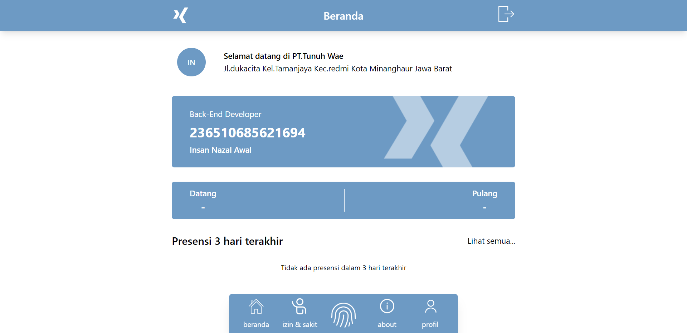
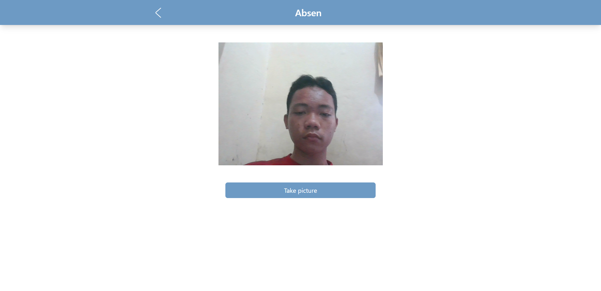
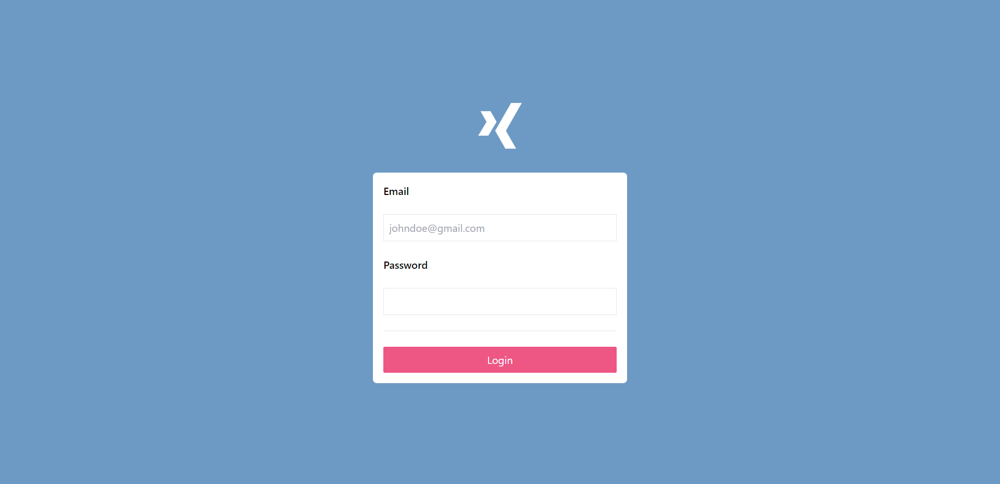

<p align="center"><strong>Presensi Laravel - Employee</strong></p>
<p align="center"><sub>Laravel Tailwind</sub></p>
<p align="center"><sub>Jangan lupa tekan 🌟</sub></p>

## Langkah untuk menggunakan Presensi Laravel - Employee

1. ```git clone https://github.com/insanXYZ/presenLaravelEmployee.git```
2. ```cd presenLaravelEmployee```
3. ```composer install```
4. ```npm install```
5. ```php artisan migrate```
6. ```php artisan serve```
7. ```npm run dev```

**Catatan:**
- untuk membuat akun bisa masuk ke ```/signup``` secara manual.
- jangan lupa izinkan akses lokasi dan kamera untuk absensi.
